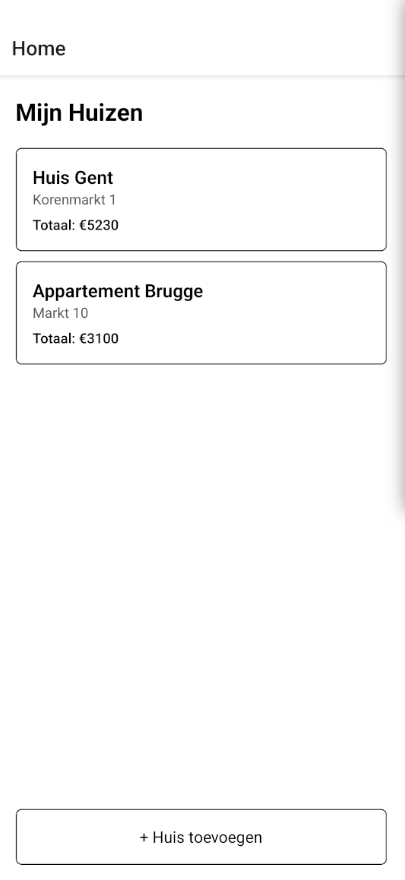
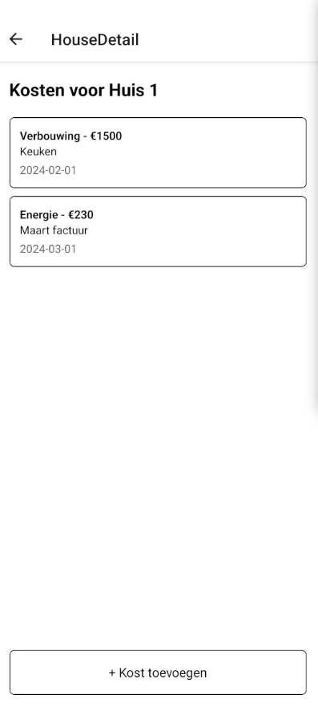

# Permanente evaluatie

**Vul hieronder verder aan zoals beschreven in
de [projectopgave](https://javascript.pit-graduaten.be/evaluatie/mobile/pe.html).**

## Scherm 1

Overzicht huizen

In dit scherm wil ik een overzicht met alle toegevoegde adresen/huizen.
Er is ook de mogelijkheid om een nieuw adres toe te voegen.

Onderaan wil ik twee tabs hebben:

- lijst
- kaart
  Op de kaart zie je de locatie van de huizen met een pin.
  In de lijst zie je alle huizen met een knop om naar de details te gaan.

## Scherm 2

Huisdetails

Je kan hier de details van een huis bekijken.
Per kost kan je het bedrag, datum, categorie en beschrijving zien.
Er is ook de mogelijkheid om een nieuwe kost toe te voegen onderaan de lijst met kosten.
Via een longpress kan je een kost verwijderen.

## Scherm 3

Kosten toevoegen

In dit scherm kan je een kost toevoegen aan een huis.
Je krijgt een form met volgende velden:

- categorie
- datum
- bedrag
- beschrijving

Er is ook de mogelijkheid om een foto toe te voegen.
Je kan deze foto nemen met je camera of een bestaande foto selecteren.

## Scherm 4

Huis toevoegen

Dit scherm is voor het toevoegen van een nieuw adres.
Je krijgt een form met volgende velden:

- adres
- postcode
- plaats
- land

Vrij vergelijkbaar met het scherm voor het toevoegen van een kost.

## Native modules

In mijn app wil gebruik maken van volgende 2 native modules:

Camera: In het scherm waarin je kosten kan toevoegen aan een huis is er de mogelijkheid
om een foto toe te voegen van bijvoorbeeld een ticket of rekening.

Locatie: Je kan op een kaart de locatie van de verschillende huizen raadplegen.

## Online services

Ik wil Firebase gebruiken voor authenticatie.

## Gestures & animaties

In het scherm van Huisdetails is er de mogelijkheid om een item te selecteren via een longpress en dan krijgt de
gebruiker
de optie om deze uit de lijst te verwijderen.

# Feedback

Je beschrijving is relatief goed, de app voldoet ook aan de vereisten en is zeker haalbaar.

Het enige wat ik mis is een animatie, je hebt wel een gesture beschreven, maar geen animatie. Ook komen je schreenshots
niet echt overeen met hetgeen dat je er onder beschrijft (je spreekt over tabs maar die zijn nergens zichtbaar).

Verder zie ik geen moeilijkheden of dingen die complex zijn om te implementeren.

**18.5/20**
